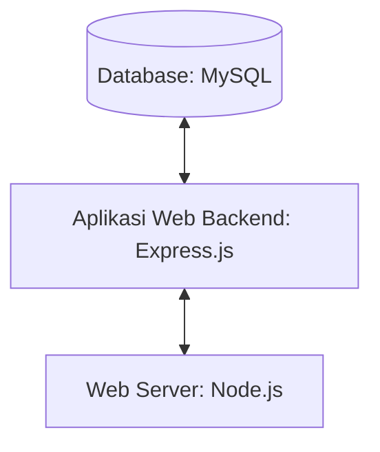

## 1.1 Latar Belakang

GoingToon adalah aplikasi mobile layanan yang menyediakan bermacam-macam film kartun didalamnya, dan penggunanya menonton tayangan kesukaan di mana pun, kapan pun, dan hampir lewat media apa pun seperti smartphone, smartTV, tablet, PC, dan laptop. GoingToon ini merupakan media hiburan untuk semua kalangan yang memiliki kesukaan terhadap film-fil animasi atau kartun. GoingToon ini bisa digunakan untuk media untuk menghilangkan rasa bosan dan ingin menonton film-film yang ringan dan menyenangkan. GoingToon ini dibuat dengan tujuan supaya anak-anak bisa menonton film yang seharusnya merupakan tontonan yang pas untuk dengan perkembangan anak-anak, dan tidak bercampur dengn film-film yang bukan tontonan anak-anak seperti film Romance, Horor dll, karena beberapa platfrom yang menyediakan film-film kartun itu bercampur dengan film-film dewasa, Sehingga dengan adanya GoingToon ini bisa menjadi sarana menonton film tanpa ganguan apapun. GoingToon ini juga tidak hanya dipergunakan untuk anak-anak tetapi untuk semua kalangan, Banyak orang yang sudah dewasa justru lebih menyukai tayangan yang biasa ditonton anak-anak ini. Film kartun menyuguhkan tontonan dengan adegan yang lucu, terkadang tayangan kartun juga berkaitan dengan keadaan yang sedang terjadi sekarang. Dengan adaynya Goingtoon ini bisa bermanfaat untuk Meningkatkan kepercayaan diri : karena beberapa film kartun, mengusung cerita pahlawan super, atau seseorang yang selalu beruntung, selamat dari kemalangan,disadari atau tidak, dengan menonton tayangan seperti itu, membuat kita menjadi lebih percaya diri dan memiliki kekuatan untuk menghadapi dunia. Menghidupkan/Mengenang Kembali Kenangan Masa Lalu : karena saat menonton adegan dan film kartun yang kamu sukai, suasana masa kecil kamu akan hidup kembali,dikarenakan saat menonton film kartun, otak kamu akan menangkap kamu sedang melakukan aktivitas-aktivitas yang menyenangkan,sehingga nonton film kartun dianggap sebagai kenangan yang indah, dan tidak mudah dilupakan. Mengajarkan Pelajaran Hidup : karena kartun mengajarkan beberapa pelajaran luar biasa dalam hidup kartun memberikan pesan berupa kesadaran sosial,tidak jarang kartun memberikan pesan tersirat berupa sindiran, yang bisa menyadarkan masyarakat tentang kehidupan sosial masyarakat, perpaduan antara warna, karakter animasi dan efek audiovisual menggabungkan pengalaman belajar otak yang lebih baik, bahkan hal itu jauh lebih baik daripada melalui pembelajaran secara konvensional. Pereda Stres : karena menurut berbagai penelitian obat terbaik untuk mengatasi stres adalah tawa, dan kartun adalah pengundang tawa terbaik dan orang dewasa yang gemar nonton kartun memiliki penyakit stres yang lebih rendah. 

## 1.2. Deksripsi Teknologi Informasi
GoingToon adalah plarform daring yang manyajikan sensasi menonton film kartun dengan mudah, dan nyaman. Dimana didalamnya banyak sekali berbagai film kartun dengan berbagai macan genre dan karakter dan menyajikan film-film dari berbagai negara. Dengan adanya website pengguna bisa menonton film-film kartun tanpa gangguan apapun dimana saja dan kapan saja. 
## 1.3. Branding
- Merk : GoingToon
- Tagline : "Watch together, be happy together"
- Campaign : Membuat Website/Aplikasi untuk menonton film karun yang membuat penggunanya senang ketika menonton
- Target user :
  - Usia 5+
  - Anak-anak yang sedang masa pertumbuhan, sebagai edukasi
  - Orang-orang yang senang terhadap film kartun
  - Orang-orang yang senang berimajinasi
  - Orang-orang yang senang Cerita atau karakter fiksi

## 2. User Story
Sebagai | Yang bisa dilakukan | prioritas
---|---|---
Pengguna | Bisa menonton Film Kartun Favorit | ⭐⭐⭐⭐⭐
Pengguna | Bisa mencari film yang ingin di tonton | ⭐⭐⭐⭐⭐
Pengguna | Bisa mendownload film untuk ditonton secara offline | ⭐⭐⭐
Pengguna | Bisa melihat film yang sedang populer | ⭐⭐⭐
Pengguna | Bisa melihat film-film kartun teruptodate | ⭐⭐⭐
Pengguna | Bisa melihat film kartun zaman dulu | ⭐⭐
Pengguna | Bisa menonton film kartun dari berbagai negara | ⭐⭐⭐⭐
Pengguna | Bisa melihat film kartun dengan berbagai genre | ⭐⭐⭐⭐⭐
Pengguna | Bisa menggunakan subtitle dalam berbagai bahasa | ⭐⭐⭐
Pengguna | Bisa menyusun daftar putar pribadi | ⭐⭐⭐
Pengguna | Bisa mendapatkan rekomendasi film berdasarkan sejarah penontonan | ⭐⭐⭐⭐
Pengguna | Bisa memiliki kontrol orang tua yang efektif untuk membatasi akses anak-anak terhadap konten yang tidak sesuai | ⭐⭐⭐⭐⭐
Pengguna | Bisa mendapatkan notifikasi ketika episode terbaru dari seri TV favorit telah dirilis | ⭐⭐⭐⭐
Pengguna | Bisa berbagi atau merekomendasikan film kepada teman-temannya melalui platform media sosial | ⭐⭐⭐⭐
Pengguna | Bisa mengatur resolusi film | ⭐⭐⭐⭐
Pengguna | Bisa melihat riwayat film yang pernah ditonton | ⭐⭐⭐⭐
Pengguna | Bisa Berlangganan dengan membayar tagihan perbulan | ⭐⭐⭐
Pengguna | Bisa menonton film favorit tanpa gangguan iklan yang berlebihan ketika sudah berlanganan | ⭐⭐⭐⭐
Pengguna | Bisa menonton film terbaru ketika sudah berlangganan | ⭐⭐⭐
Pengguna | Bisa mendapatkan tawaran percobaan gratis atau promosi khusus untuk dapat mencoba layanan tanpa membayar |  ⭐⭐⭐

## 3. Struktur Data

## 4. Arsitektur Sistem

## 5. Teknologi, Library, dan Framework

    UI/UX Design : Canva
    Web Server : Node.js 
    Text Editor : VS Code
    Browser : Chrome
    Library : React.js
    Framework : Express.js 
    Database : MySQL

**Alasan mengapa saya memilih Node.js sebagai web server untuk aplikasi ini:**
          Node.js dirancang untuk menangani banyak koneksi bersamaan secara efisien karena menggunakan model I/O yang bersifat asinkron. Ini memungkinkan server untuk menangani permintaan banyak pengguna secara bersamaan tanpa perlu membuat thread untuk setiap koneksi, yang dapat menghemat sumber daya sistem. Node.js menggunakan arsitektur yang berbasis event. Ini memungkinkan server untuk menanggapi peristiwa seperti permintaan HTTP atau streaming data dengan cepat dan efisien. Dalam konteks streaming film, di mana data harus dikirimkan ke klien secara terus-menerus, arsitektur berbasis event sangat berguna. Node.js menyediakan dukungan bawaan untuk streaming data. Ini berarti server dapat mengirimkan data ke klien secara progresif tanpa harus menunggu seluruh data selesai dihasilkan. Hal ini sangat penting dalam aplikasi streaming di mana data (video) dikirimkan secara kontinu. Node.js memiliki ekosistem yang kaya melalui NPM. Terdapat banyak paket atau modul yang dapat digunakan untuk mempermudah pengembangan aplikasi streaming, seperti modul untuk pengelolaan koneksi, penanganan video, dan lainnnya. Node.js memberikan fleksibilitas dalam membangun server. Anda dapat menggunakan framework seperti Express.js untuk mempermudah pengembangan, atau Anda dapat membangun server tanpa menggunakan framework. Fleksibilitas ini memungkinkan pengembang untuk menyesuaikan server sesuai kebutuhan aplikasi streaming tertentu. Karena Node.js dapat menangani banyak koneksi bersamaan dengan cara yang efisien, itu memungkinkan untuk penskalaan horizontal. Ini berarti Anda dapat menambahkan lebih banyak instance Node.js atau server secara keseluruhan untuk menangani lonjakan lalu lintas yang besar. Node.js diketahui memiliki kinerja yang tinggi, terutama dalam menangani banyak koneksi bersamaan dan operasi I/O yang bersifat asinkron. Performa tinggi ini menjadi keunggulan ketika menangani aplikasi streaming yang memerlukan pengiriman data yang cepat dan responsif.

**Alasan Mengapa saya memilih React.js sebagai Library untuk aplikasi ini:**
          React.js adalah library JavaScript yang sangat populer dan sering digunakan untuk membangun antarmuka pengguna (UI) yang responsif dan dinamis. React menggunakan Virtual DOM, yang memungkinkan perubahan pada UI diterapkan dengan efisien. Dalam aplikasi streaming, di mana konten mungkin berubah secara dinamis (seperti pemutaran video), kemampuan untuk memperbarui tampilan dengan cepat sangat penting. React mempromosikan konsep pembangunan UI melalui komponen yang dapat digunakan kembali. Dalam aplikasi streaming film, ini berarti Anda dapat membuat komponen seperti pemutar video, daftar film, atau komponen lainnya, dan menggunakannya secara berulang tanpa perlu menulis kode yang sama berulang-ulang. React mendukung SSR dan SSG, yang memungkinkan aplikasi dapat di-render di server atau pada tahap build, meningkatkan performa dan SEO. Dalam konteks streaming film, ini dapat membantu memastikan bahwa konten dapat diakses dengan cepat dan optimal oleh mesin pencari. React.js cocok untuk aplikasi streaming film karena menyediakan alat dan pola desain yang memfasilitasi pembangunan antarmuka pengguna yang dinamis dan interaktif.

**Alasan Mengapa saya memilih Express.js sebagai Framework untuk aplikasi ini:**
Express.js adalah framework untuk pengembangan aplikasi web berbasis Node.js yang sangat ringan dan fleksibel. Express.js dirancang dengan fokus pada kesederhanaan dan kemudahan penggunaan. Ini memudahkan pengembang untuk membuat aplikasi web tanpa perlu menghadapi kompleksitas yang tidak perlu. Dalam pengembangan aplikasi streaming film, fokus pada kejelasan dan kemudahan penggunaan dapat mempercepat pengembangan. Express menyediakan sistem routing yang mudah dimengerti dan dapat dikonfigurasi. Ini memudahkan definisi rute untuk penanganan permintaan yang berbeda, seperti menampilkan halaman utama, menyajikan video, atau menanggapi permintaan API(Permintaan API adalah bentuk komunikasi antara dua sistem perangkat lunak — sistem pemanggil (klien API) dan sistem penerima (server API)). Express diketahui untuk memiliki performa yang tinggi, terutama dalam menangani permintaan HTTP. Hal ini sangat penting dalam aplikasi streaming yang membutuhkan pengiriman data yang cepat dan efisien. Express mendukung streaming data, yang dapat sangat bermanfaat dalam aplikasi streaming film. Ini memungkinkan pengembang untuk mengirimkan video secara progresif kepada pengguna, mengoptimalkan pengalaman pengguna.

**Alasan Mengapa saya memilih MySQL sebagai Database untuk aplikasi ini:**
MySQL berbasis pada model basis data relasional, yang memungkinkan pengorganisasian data dalam tabel terstruktur. Ini sangat berguna ketika perlu menyimpan dan mengelola berbagai jenis data terkait, seperti informasi film, kategori, pengguna, dan lainnya. MySQL mendukung sistem skala besar dengan baik. Ini dapat mengatasi basis data yang tumbuh seiring waktu, sehingga cocok untuk aplikasi streaming film yang mungkin memiliki pertumbuhan pengguna yang signifikan. MySQL dapat memberikan respons yang cepat, yang sangat penting dalam aplikasi streaming untuk menyediakan data secara efisien. MySQL mendukung transaksi ACID (Atomicity, Consistency, Isolation, Durability)yaitu sebuah konsep dalam sistem manajemen basis data (DBMS) yang mengidentifikasi sekumpulan properti standar yang digunakan untuk menjamin keandalan basis data tertentu, yang memastikan keandalan dan keamanan data. Ini penting dalam aplikasi streaming di mana integritas data dan keamanan informasi pengguna harus dijaga.

## 6. Desain User Experience dan User Interface

## 7. Demonstrasi Video

## 8. Bagaimana mesin komputasi dan sistem operasi berperan dalam produk teknologi informasimu ?

**Mesin Komputasi** : Istilah “komputasi” menjelaskan konsep dan objek yang berkaitan dengan komputasi perangkat lunak. Komputasi merupakan istilah umum yang biasa digunakan untuk merujuk pada daya pemrosesan, memori, jaringan, penyimpanan, dan sumber daya lainnya yang diperlukan agar komputasi program berhasil. Misalnya, aplikasi yang menjalankan algoritme machine learning atau fungsi rendering grafis 3D memerlukan bergiga-giga RAM dan beberapa CPU agar berhasil dijalankan. Dalam hal ini, CPU, RAM, dan Unit Pemroses Grafis yang diperlukan disebut sebagai sumber daya komputasi, dan aplikasinya disebut sebagai aplikasi intensif komputasi. Contoh Mesin komputasi diantara komputer atau perangkat mobile, adalah perangkat keras(hardware) yang menjadi dasar bagi produk teknologi informasi. Komponen seperti CPU, RAM, penyimpanan, dan perangkat keras lainnya memungkinkan perangkat tersebut untuk menjalankan perangkat lunak (software) yang merupakan inti dari produk teknologi informasi.

**Sistem Operasi** : Sistem operasi adalah suatu program yang mengontrol eksekusi program aplikasi dan berfungsi sebagai antarmuka antara pengguna komputer dengan perangkat keras komputer. Sistem operasi menyediakan berbagai fasilitas dan layanan seperti editor dan debugger, untuk membantu para pemogram dalam membuat program.Sistem operasi bertindak sebagai penghubung antara pengguna, aplikasi, dan perangkat keras komputer. Sistem operasi mengatur penggunaan sumber daya komputer seperti CPU, memori, dan perangkat input/output. Sistem operasi sangat penting untuk memastikan bahwa komputer dapat beroperasi dengan efisien dan produktif. Sistem operasi memungkinkan pengguna untuk menjalankan program aplikasi, seperti aplikasi pengolah kata, peramban web, atau aplikasi multimedia. Sistem operasi memastikan bahwa program aplikasi tersebut berjalan dengan benar dan memperoleh akses ke sumber daya yang diperlukan. Contoh Sistem Operasi atau Operating System (OS) yaitu windows, linux, macOS,androis dan iOS.

## 9. Bagaimana algoritma, struktur data, dan bahasa pemrograman berperan dalam produk teknologi informasimu ?

1. **Algoritma**
Algoritma adalah metode atau langkah-langkah yang dirancang secara teratur dan berurutan untuk memecahkan atau menyelesaikan masalah melalui instruksi atau tindakan.

**Peran atau fungsi algoritma** membantu memecahkan masalah secara logis dan menciptakan program yang efektif. Dan dengan adanya algoritma dapat menyederhanakan alur kerja dan logika saya untuk memudahkan dalam menulis kode atau source code, begitu juga dengan algoritma ini dapat meningkatkan kinerja, kecepatan, dan efektivitas dalam mengembangkan suatu produk.

2. **Struktur Data**
Struktur data adalah cara mengatur dan menyimpan sebuah struktur di sistem komputer atau database sehingga data tersebut lebih mudah untuk diakses. Struktur data memiliki format khusus yang berfungsi untuk mengatur, memproses, mengambil, dan menyimpan data.

**Peran atau fungsi struktur data** antara lain dapat menyimpan data secara terstruktur dalam memori komputer dan memungkinkan akses dan manipulasi data yang efisien, mengatur data,membuat proses pemrograman lebih mudah, dan dengan adanya strutur data ini bisa meningkatkan kualitas alogaritma, dengan menggunakan struktur data yang tepat, pencarian data dapat dilakukan dengan cepat dan efisien, dan dengan memanfaatkan struktur data yang efisien, penggunaan memori dapat dioptimalkan dan alokasi memori dapat dilakukan secara tepat.

3. **Bahasa pemrograman**
Bahasa pemrograman adalah sistem komunikasi antara manusia dan mesin yang digunakan untuk menginstruksikan atau memberitahukan mesin komputasi dalam melakukan tugas tertentu.

**Peran atau fungsi bahasa pemrograman** Bahasa pemrograman dapat mengatur kontrol perangkat internal ke perangkat eksternal. Bahasa pemrograman memungkinkan manusia untuk mengkomunikasikan instruksi ke mesin.Dan untuk projects yang saya buat ini saya menggunakan bahasa pemrograman HTML (HyperText Markup Language), CSS (Cascading Style Sheets), dan JavaScript. Dengan kombinasi ketiga bahasa pemrograman tersebut, pengembang dapat membangun website yang dinamis, menarik, dan responsif. HTML menyediakan struktur, CSS memberikan tampilan yang menarik, dan JavaScript memberikan interaktivitas kepada pengguna.

## 10. Bagaimana metode pengembangan perangkat lunak / Software Development Life Cycle berperan dalam produk teknologi informasimu ?

Software Development Life Cycle (SDLC) berperan kunci dalam pengembangan produk teknologi, termasuk aplikasi streaming film. Dalam konteks aplikasi streaming film, SDLC membantu dalam merancang, mengembangkan, dan memelihara aplikasi dengan memastikan bahwa tahapan pengembangan dilakukan secara terstruktur dan efisien. Berikut adalah cara SDLC berperan dalam pengembangan aplikasi streaming film:

**Perencanaan:**
Peran dalam Aplikasi : Identifikasi tujuan dan kebutuhan aplikasi streaming film. Perencanaan ini mencakup penentuan fitur utama, pengalaman pengguna yang diinginkan, dan analisis persyaratan teknis dan fungsional.
Manfaat: Memastikan bahwa tim pengembang memiliki pemahaman yang jelas tentang arah proyek dan tujuan aplikasi streaming film.

**Analisis Kebutuhan:**
Peran dalam Aplikasi : Mendefinisikan kebutuhan pengguna, fungsionalitas inti, dan persyaratan sistem. Ini melibatkan pemahaman mendalam tentang fitur-fitur streaming, manajemen konten, pengaturan pengguna, dan aspek-aspek keamanan.
Manfaat: Memastikan bahwa pengembang memahami secara menyeluruh apa yang diinginkan oleh pengguna dan bagaimana aplikasi dapat memenuhi kebutuhan tersebut.

**Desain:**
Peran dalam Aplikasi : Merancang arsitektur aplikasi, antarmuka pengguna, dan basis data. Desain melibatkan pengambilan keputusan terkait bagaimana aplikasi akan menyajikan dan mengelola konten video, serta bagaimana pengguna akan berinteraksi dengan aplikasi.
Manfaat: Menjamin bahwa aplikasi dirancang untuk kinerja dan skalabilitas optimal, serta memberikan pengalaman pengguna yang memuaskan.

**Implementasi (Coding):**
Peran dalam Aplikasi : Menuliskan kode untuk mengimplementasikan desain dan fungsionalitas yang telah ditentukan sebelumnya. Ini mencakup pengembangan backend, frontend, integrasi dengan layanan streaming, dan manajemen basis data.
Manfaat: Menerjemahkan desain menjadi produk nyata dan menjaga konsistensi dengan persyaratan yang telah ditentukan.

**Pengujian:**
Peran dalam Aplikasi : Melakukan pengujian fungsional, uji kinerja, dan pengujian integrasi untuk memastikan bahwa aplikasi bekerja sebagaimana mestinya. Pengujian pada aplikasi streaming film juga melibatkan uji kualitas video, pemutaran streaming, dan pengujian beban.
Manfaat: Menjamin bahwa aplikasi dapat menangani beban pengguna yang besar dan menyajikan konten video dengan kualitas tinggi.

**Pengelolaan Perubahan dan Pemeliharaan:**
Peran dalam Aplikasi : Mengelola perubahan dan pemeliharaan setelah aplikasi diluncurkan. Ini melibatkan pembaruan fitur, perbaikan bug, dan penanganan perubahan kebutuhan pengguna atau teknologi.
Manfaat: Memastikan bahwa aplikasi tetap relevan, aman, dan dapat diandalkan sepanjang waktu.

**SDLC membantu dalam menciptakan suatu proses yang terstruktur dan meminimalkan risiko kegagalan pengembangan. Dengan mengikuti langkah-langkah SDLC, pengembang dapat memastikan bahwa aplikasi streaming film dibangun dengan baik, dapat diandalkan, dan memberikan pengalaman streaming yang optimal kepada pengguna.**

## 11. Bagaimana database / sistem basis data berperan dalam produk teknologi informasimu ?

Database atau sistem basis data berperan kunci dalam aplikasi streaming film dengan menyimpan, mengelola, dan menyediakan akses terhadap data yang diperlukan oleh aplikasi. Berikut adalah beberapa peran utama database dalam produk teknologi aplikasi streaming film:

**Penyimpanan Konten Multimedia:**
Database menyimpan file multimedia seperti video, audio, gambar, dan metadata terkait yang diperlukan untuk streaming film. Ini termasuk data kualitas video, informasi pemutaran, dan data lainnya.

**Manajemen Konten:**
Database digunakan untuk mengelola metadata konten seperti judul film, deskripsi, sutradara, pemeran, kategori, dan ulasan. Informasi ini membantu dalam pencarian, kategorisasi, dan penilaian konten.

**Manajemen Pengguna:**
Informasi pengguna seperti data akun, riwayat penontonan, preferensi, dan informasi otentikasi disimpan dalam database. Ini memungkinkan personalisasi pengalaman pengguna dan menyediakan rekomendasi konten yang relevan.

**Manajemen Sesuai Hak Cipta:**
Basis data memainkan peran dalam manajemen hak cipta dan lisensi. Ini mencakup informasi lisensi konten, pembatasan geografis, dan perincian hak distribusi.

**Analisis dan Pelaporan:**
Database menyimpan data tentang perilaku pengguna, seperti waktu pemutaran, durasi penontonan, dan reaksi pengguna terhadap konten. Data ini dapat digunakan untuk analisis kinerja, membuat laporan, dan meningkatkan rekomendasi konten.

**Manajemen Koneksi dan Streaming:**
Informasi terkait koneksi pengguna, kapasitas jaringan, dan preferensi resolusi streaming dapat disimpan dalam database. Ini membantu dalam mengoptimalkan kualitas pemutaran dan pengalaman pengguna berdasarkan kondisi jaringan.

**Keamanan dan Perlindungan Data:**
Basis data perlu mengelola keamanan data, termasuk otentikasi pengguna, enkripsi data sensitif, dan kontrol akses. Ini penting untuk melindungi informasi pribadi pengguna dan hak cipta konten.

**Pemeliharaan Data:**
Database memfasilitasi pemeliharaan data, termasuk perbaikan bug, pembaruan konten, dan penanganan pembaruan atau peningkatan aplikasi. Ini memastikan ketersediaan data yang konsisten dan up-to-date.

**Skalabilitas:**
Database harus dapat berkembang seiring dengan pertumbuhan aplikasi dan jumlah pengguna. Desain database yang baik memungkinkan skalabilitas horizontal atau vertikal untuk mengatasi beban pengguna yang meningkat.

**Backup dan Pemulihan:**
Database menyediakan mekanisme untuk melakukan pencadangan data secara teratur dan memungkinkan pemulihan data dalam kasus kegagalan sistem atau insiden lainnya.

**Dengan peran-peran ini, database menjadi fondasi kritis dalam menjalankan aplikasi streaming film dengan baik. Pemilihan jenis database (SQL atau NoSQL), desain skema, dan optimisasi kueri menjadi faktor-faktor penting dalam memastikan performa dan kehandalan sistem basis data.**
